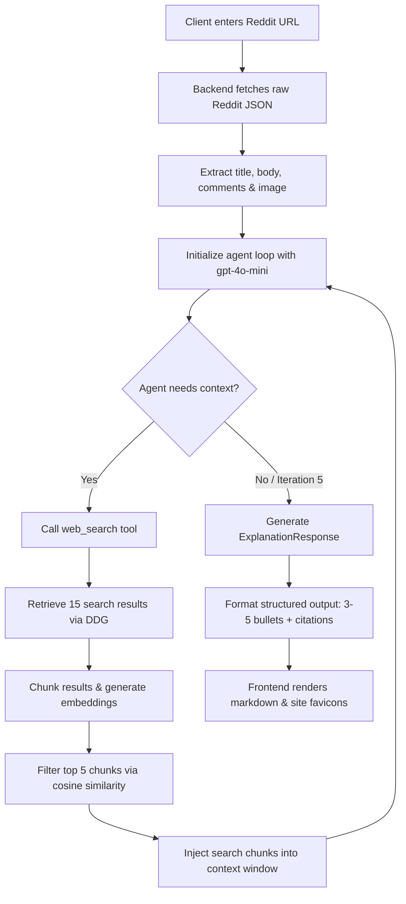

# Reddit Context Agent

An AI-powered agentic system that fetches Reddit threads and automatically researches the web to explain internal references, slang, memes, or complex context in a structured summary.

---

## Prerequisites & Dependencies

To run this project, make sure you have the following installed:

1.  **Python** (using [**`uv`**](https://github.com/astral-sh/uv) for fast package and environment management).
2.  **Node.js** (including `npm`/`npx` for package management).
3.  **OpenAI API Key** (to power the context retrieval agent and embeddings).

---

## Quick Start (Step-by-Step Execution)

Follow these steps to run the application locally:

### Step 1: Configure Environment Variables
Create a `.env` file in the `./backend/` directory:

```bash
# Inside ./backend/.env
OPENAI_API_KEY=your_openai_api_key_here
PORT=8000
FRONTEND_PORT=5173
```

### Step 2: Start the Backend Server
Run the following commands to initialize and synchronize dependencies, then spin up the FastAPI server:

```bash
cd backend
uv sync
uv run uvicorn main:app --reload
```
*The backend API will be running on `http://localhost:8000`.*

### Step 3: Start the React Frontend
Open a new terminal tab and run:

```bash
cd frontend
npm install
npm run dev
```
*Open your browser and navigate to `http://localhost:5173` to test the application.*

### Step 4 (Optional): Run the Evaluation Harness
To synchronize dependencies and run the benchmark harness:

```bash
cd eval_harness
uv sync
uv run python run_eval.py
```
*Results will be compiled in `./eval_harness/eval_results.md`.*

---

## 📂 Project Organization

*   **[`./backend`](./backend)**: FastAPI backend web server, Reddit ingestion client, transient RAG embedding agent, and unit tests.
*   **[`./frontend`](./frontend)**: Vite + React client app, featuring preset sample posts, glassmorphic styling, and animated load steppers.
*   **[`./eval_harness`](./eval_harness)**: Evaluation benchmark runner and LLM-as-a-judge scoring script.

---

## ⚙️ How it Works (System Flow)



---

## 🧪 Running Tests

To run the backend unit tests (mocking external APIs):

```bash
cd backend
uv run python -m unittest test_backend.py
```

---

## Design Decisions & Platform Choice

* **Platform Pivot (Reddit vs. Bluesky):** While the secondary PDF mentioned Bluesky, the primary assignment instructions explicitly stated: *"you’re free to choose any social platform or public text source (e.g., X, Reddit, news, blogs)."* I intentionally chose **Reddit** because its deep threading, niche communities, and frequent use of obscure internet slang provide a much richer testing ground to demonstrate the agent's web-search and context-resolution capabilities.
* **Agentic RAG & Reranking:** To fulfill the ML-module bonus, the `search_web` tool doesn't just return raw DuckDuckGo results. It chunks the web results, generates OpenAI embeddings on the fly, computes cosine similarity against the query using Numpy, and injects only the top semantic matches into the agent's context window.
* **Strict Constraints Verification:** The 3-5 bullet points constraint is strictly enforced at the API level using OpenAI's Structured Outputs (Pydantic parsing) rather than relying solely on prompt engineering.
